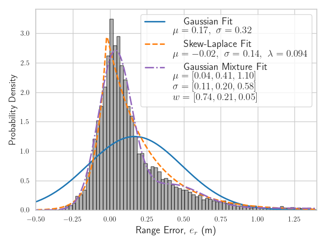
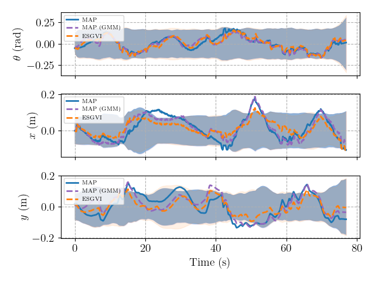
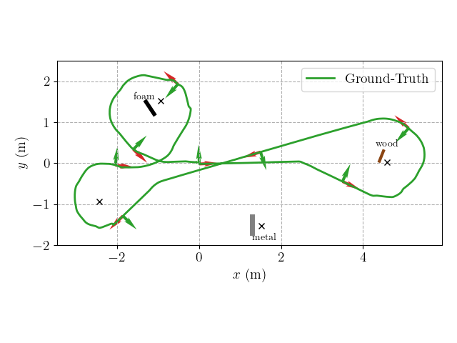

# GVI Workspace

A Python package for exactly-sparse gaussian variational inference (ESGVI) for batch state estimation in robotics. This workspace includes simulation tools, models, and the ESGVI solver built around the [`navlie`](https://github.com/decargroup/navlie) library.

## Project Structure
```
├── config/ # YAML configuration files for simulations and experiments
├── data/ # Simulation data and experiment results
│ ├── real/ # Experimental data
│    ├── bags # ROS bag data from experiment
│    ├── cluttered/ # Pickled calibrated odometry, mocap, and uwb data
│    ├── fit_skew_laplace.py # Functions to fit skew-Laplace params
│    └── plat_raw.py # Script to plot raw/calibrated rosbag data
│ ├── results/ # Output data/results from experiments
│ └── sim/ # Simulation data and generator script
├── examples/ # Example scripts and experiment pipelines
├── figs/ # Generated plots and figures
├── pyproject.toml # Project metadata and dependencies
├── readme.md # Project documentation
├── src/ # Source code
└── tests/ # Unit tests
```

## Installation

Recommended to use a virtual environment:

```bash
# Create and activate environment (optional)
python -m venv .venv
source .venv/bin/activate 

# Install dependencies
pip install -e .
```
## Getting Started

### Running Simulations

1. **Generate simulation data.** 

To generate and plot simulated data, from the project root, run:

```bash
python data/sim/generate_sim_data.py 
```
To configure the simulation parameters, change the ``config/gen_data.yaml``, and ``config/noise_config.yaml`` files.

2. **Run the estimators.**

If you generated an SE(2) simulation, run

```bash
python examples/se2_localization.py
```

This will generate output data (pickled objects) and save them to the data/results/se2/ folder. Similarly, to change the estimator parameters, consult ``config/se2_localization.yaml``. 

Similarly, to run the estimators on SE(2) with the experimental data from the `"cluttered"` dataset, use

```bash
python examples/cluttered_localization.py
```

3. **Plotting.**

To plot the results, run:

```bash
python examples/plot_results.py
```
Being sure to set the `DATASET` variable to either `"se2"` or `"cluttered"` in the script, depending on which results you want to visualize.

## Figures and Results

Plots and benchmark figures are generated into the `figs/` directory by the example scripts. These include:

- RMSE and NEES performance plots.
- Measurement comparisons given various noise models (Gaussian, Cauchy, Student-T, Skew-Laplace)
- Estimated trajectories of the robot.


Relevant plots appearing in the paper can be regenerated as follows:

- **Raw experimental UWB data** can be visualized using  
```bash
python data/real/plot_raw.py
```
- **Estimator performance on experimental data** is plotted using
```bash
python examples/plot_results.py
```

Alternatively, all plots come pregenerated and can be seen here

#### UWB calibrated ranges (experimental data)



#### Estimation error with 3σ bounds



#### Ground truth trajectory with obstacles



## Dependencies

Developed with tools from the [DECAR group](https://www.decar.ca/):
- [`navlie`](https://github.com/decargroup/navlie) — State estimation tools,
- [`pymlg`](https://github.com/decargroup/pymlg) — Lie group math.

Other library dependencies:
- `numpy`, `scipy`, `matplotlib`.

See `pyproject.toml` for full dependency list.